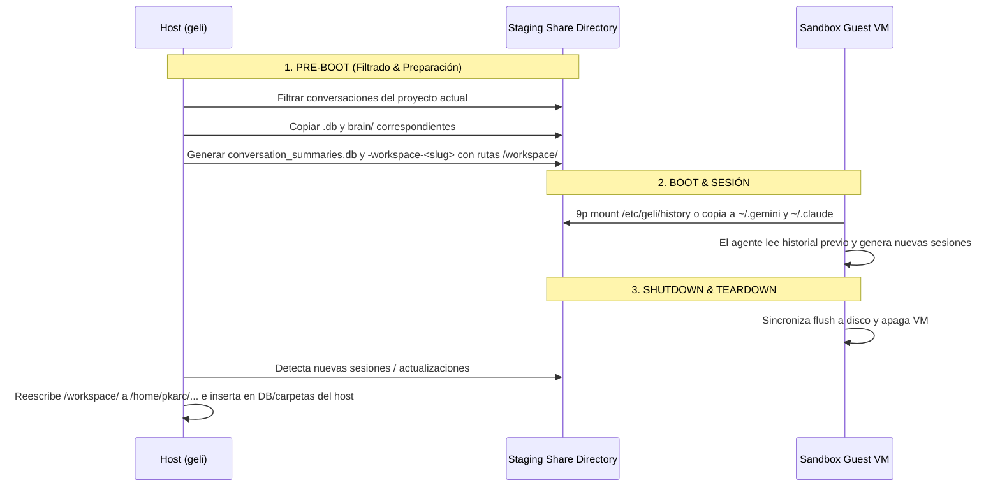

# Arquitectura y Diseño: Manejo del Historial Bidireccional por Proyecto en `geli`

Este documento detalla el análisis de cómo **Antigravity CLI (`agy`)** y **Claude Code (`claude`)** almacenan su historial en el host, los problemas de aislamiento al correr dentro de máquinas virtuales sandbox, y el diseño propuesto para sincronizar el historial **específico del proyecto abierto** de forma bidireccional.

---

## 1. Contexto y Problema

Actualmente `geli` ejecuta agentes dentro de máquinas virtuales aisladas (QEMU/KVM sobre Alpine Linux) montando el código fuente vía `9p` en `/workspace/<nombre_proyecto>`.

- **Aislamiento de credenciales e historial:**
  - Por diseño de seguridad, `geli` no copia todo el directorio `~/.gemini` ni `~/.claude` del host para no filtrar historiales de otros proyectos/clientes.
  - Sin embargo, al iniciar una sesión sandbox, el agente no encuentra el historial previo del proyecto abierto (imposibilitando reanudar conversaciones con `/resume` o mantener el hilo de contexto).
  - Asimismo, al cerrarse la VM efímera, cualquier conversación nueva generada dentro del sandbox se destruye con la máquina.

---

## 2. Estructura del Historial por Agente

### A. Antigravity CLI (`agy`)

`agy` guarda su estado en `~/.gemini/antigravity-cli/`:

1. **`conversation_summaries.db` (SQLite):**
   - Tabla `conversation_summaries`.
   - Contiene metadatos de todas las conversaciones.
   - Columna clave: `workspace_uris` (ejemplo: `["file:///home/pkarc/github/geli"]`).
   - Relaciona cada `conversation_id` con la ruta absoluta del workspace en el host.

2. **`conversations/<conversation_id>.db` (SQLite por conversación):**
   - Almacena el log detallado de pasos, checkpoints, tool calls y contexto de la conversación.

3. **`brain/<conversation_id>/` (Directorio de artefactos y logs):**
   - Contiene artefactos generados, transcripciones (`transcript.jsonl`, `transcript_full.jsonl`) y logs de tareas en background.

---

### B. Claude Code (`claude`)

`claude` almacena su historial de forma modular en `~/.claude/`:

1. **`~/.claude/projects/<slug_directorio>/`:**
   - Para cada proyecto en el host se genera un slug basado en la ruta absoluta, reemplazando `/` por `-`.
   - Ejemplo: `/home/pkarc/github/geli` $\rightarrow$ `~/.claude/projects/-home-pkarc-github-geli/`
   - Dentro contiene:
     - Archivos de sesión: `<session_id>.jsonl`
     - Carpeta `memory/` (memorias persistentes del proyecto).

---

## 3. Desafío Técnico: Diferencia de Rutas Host vs Guest

| Entorno | Ruta del Proyecto | URI en Base de Datos (`agy`) | Slug de Carpeta (`claude`) |
| :--- | :--- | :--- | :--- |
| **Host** | `/home/pkarc/github/geli` | `file:///home/pkarc/github/geli` | `-home-pkarc-github-geli` |
| **Guest (VM)** | `/workspace/geli` | `file:///workspace/geli` | `-workspace-geli` |

Si se montara o copiara directamente sin transformar:
- `agy` en el guest ignoraría las conversaciones porque buscaría `file:///workspace/geli`.
- `claude` buscaría `~/.claude/projects/-workspace-geli/` y no encontraría las sesiones de `-home-pkarc-github-geli/`.

---

## 4. Diseño Propuesto: Sincronización Bidireccional

### Flujo de Ejecución



---

### Detalle de Implementación

### 1. Pre-Boot (Host $\rightarrow$ Guest)

1. **Identificación de rutas:**
   - Obtener ruta canónica del host: `host_dir = /home/pkarc/github/geli`
   - Obtener ruta en el guest: `guest_dir = /workspace/geli`

2. **Para `agy`:**
   - En el directorio temporal `staging_dir/history/gemini/`:
     - Crear una base SQLite `conversation_summaries.db` efímera con el mismo esquema.
     - Adjuntar (`ATTACH DATABASE`) la base del host y ejecutar:
       ```sql
       INSERT INTO conversation_summaries
       SELECT conversation_id, title, preview, step_count, last_modified_time,
              replace(workspace_uris, '<host_dir>', '<guest_dir>'),
              status, source, project_id, agent_name, parent_conversation_id,
              nesting_depth, battle_id, winning_conversation_id, not_fully_idle,
              killed, last_user_input_time, last_user_input_step_index, app_data_dir,
              raw_summary, group_id
       FROM host_db.conversation_summaries
       WHERE workspace_uris LIKE '%<host_dir>%';
       ```
     - Copiar a `staging_dir/history/gemini/conversations/` solo los archivos `<cid>.db` de los IDs filtrados.
     - Copiar a `staging_dir/history/gemini/brain/` las carpetas `<cid>/` correspondientes.

3. **Para `claude`:**
   - Calcular slug host: `-home-pkarc-github-geli`
   - Calcular slug guest: `-workspace-geli`
   - Si existe `~/.claude/projects/-home-pkarc-github-geli/`, copiar su contenido a `staging_dir/history/claude/projects/-workspace-geli/`.

---

### 2. Ejecución en el Guest

- En [`session.yaml`](file:///home/pkarc/github/geli/src/guest/session.yaml) / [`mounts.sh`](file:///home/pkarc/github/geli/src/guest/mounts.sh):
  - Montar el directorio de staging o copiar los archivos hacia `/home/sandbox/.gemini/antigravity-cli/` y `/home/sandbox/.claude/`.
  - Asegurar permisos `chown -R sandbox:sandbox`.

---

### 3. Post-Run Sync (Guest $\rightarrow$ Host)

Cuando QEMU finaliza su ejecución (`child.wait()`):

1. **Para `agy`:**
   - Abrir la base del host `~/.gemini/antigravity-cli/conversation_summaries.db`.
   - Adjuntar la base que modificó el guest:
     ```sql
     INSERT OR REPLACE INTO conversation_summaries
     SELECT conversation_id, title, preview, step_count, last_modified_time,
            replace(workspace_uris, '<guest_dir>', '<host_dir>'),
            status, source, project_id, agent_name, parent_conversation_id,
            nesting_depth, battle_id, winning_conversation_id, not_fully_idle,
            killed, last_user_input_time, last_user_input_step_index, app_data_dir,
            raw_summary, group_id
     FROM guest_db.conversation_summaries;
     ```
   - Copiar los nuevos o modificados `<cid>.db` a `~/.gemini/antigravity-cli/conversations/`.
   - Copiar los nuevos o modificados directorios `brain/<cid>` a `~/.gemini/antigravity-cli/brain/`.

2. **Para `claude`:**
   - Copiar recursivamente los archivos de `staging_dir/history/claude/projects/-workspace-geli/` hacia `~/.claude/projects/-home-pkarc-github-geli/`.

---

## 5. Ventajas de esta Arquitectura

1. **Privacidad & Seguridad Total:**
   - El sandbox **solo** ve y contiene el historial del proyecto en el que se ejecuta. Las conversaciones de otros clientes o proyectos no viajan a la máquina virtual.
2. **Continuidad de Contexto:**
   - Permite usar comandos como `/resume` o recordar decisiones tomadas en sesiones pasadas tanto en `agy` como en `claude`.
3. **Persistencia Transparente:**
   - Todas las sesiones y artefactos creados dentro del sandbox quedan guardados en el host de manera natural.
